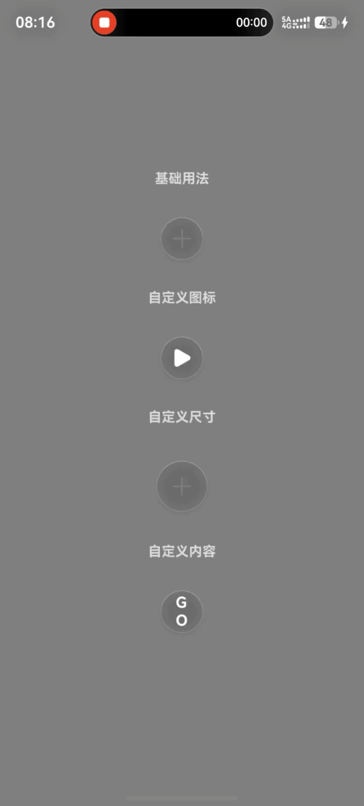
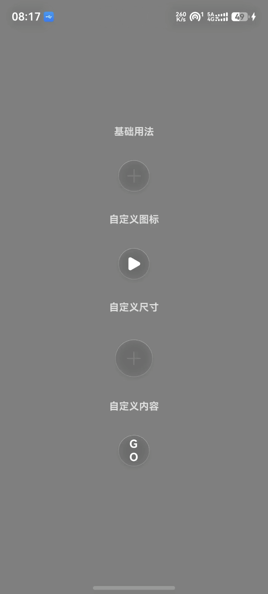

# HdsTabsMiniBar

`HdsTabsMiniBar` 是一个 HarmonyOS 示例工程，用于演示 `hds_button` 组件库的使用方式。  
组件基于 `HdsTabs` + `barFloatingStyle` 实现浮动迷你栏按钮，支持沉浸光感材质与参数化定制。

## 项目说明

- `entry`：示例应用模块（HAP），用于演示组件接入与调用场景
- `hds_button`：组件库模块（HAR），对外导出 `HdsMiniBarButton`
- 组件支持尺寸、图标、材质、布局、事件、自定义内容槽位等 15 项可配置能力
- 兼容导出 `hdsButton`（deprecated，仅保留历史兼容）

## 快速体验（本仓库）

本仓库中示例工程已在 `entry/oh-package.json5` 通过本地依赖引用组件：

```json5
"dependencies": {
  "hds_button": "file:../hds_button"
}
```

运行示例页面：

- 页面入口：`entry/src/main/ets/pages/Index.ets`
- 演示场景：基础用法、自定义图标、自定义尺寸、自定义内容（尾随闭包）

## 组件文档

参数、安装、完整 API 与高级用法请查看：

- [`hds_button/README.md`](hds_button/README.md)

## 项目结构

```text
HdsTabsMiniBar/
├── entry/                         # 示例应用（HAP）
│   └── src/main/ets/pages/Index.ets
├── hds_button/                    # 组件库（HAR）
│   ├── Index.ets                  # 对外导出入口
│   ├── README.md                  # 组件文档
│   └── src/main/ets/components/
│       ├── HdsMiniBarButton.ets   # 主组件
│       └── hdsButton.ets          # 兼容别名（deprecated）
├── img/                           # 文档图片资源目录
└── build-profile.json5
```

## 示例效果图

### 基础用法



### 自定义图标



### 自定义尺寸


### 自定义内容


## 系统要求

- HarmonyOS SDK：`6.1.0(23)` 及以上
- DevEco Studio：`5.0` 及以上

## 仓库地址

- [GitHub](https://github.com/SummerKaze/HdsButton_Component)
- [GitCode](https://gitcode.com/SummerKaze/HdsButton_Component)

## 许可证

[Apache-2.0](hds_button/LICENSE)
